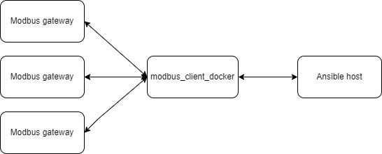

# modbus_client in docker for ansible

<br>

## Container usage
### Run container

        docker run \
        -it -p 22:22 \
        --env MODBUS_DEVICES="IP1:<ID(1)> IP2:<ID2> 192.168.1.20:10" \
        --env MODBUS_EMAIL_ADMIN="admin@example.com" \
        --env MODBUS_CREDENTIAL="<USERNAME>:<PUBLIC_SSH_KEY>" \ 
        h963z57/modbus_client-docker:main

### Debug
#### Socat connect settings
> baund rate: 9600 bps\
stop bits : 2 bit

#### View logs
> docker logs <docker_container_id>

#### View device status (ALL DEVICECES MUST BE CONNECTED)
> docker exec -it <docker_container_id> tail -f /var/log/modbus/selfhealling.log 

#### View socat log
> docker exec -it <docker_container_id> tail -f /var/log/modbus/socat.log 

#### View modbus_client log
> docker exec -it <docker_container_id> tail -f /var/log/modbus/modbus_client.log 

### Ansible playbook example

Simple playbook for on/off all relay output and apply common settings.

```yaml
- name: DANGE MASTER
  hosts: MODBUS_CLIENT
  become: true

  vars:
    OFFICE:
    # FLOOR_UNDEGROUND
      - {id: 12, slave: 119}
      - {id: 12, slave: 79}
      
    # FLOOR_ONE
      - {id: 1, slave: 34}
      - {id: 2, slave: 149}
      - {id: 3, slave: 169}
      - {id: 4, slave: 113}
      - {id: 4, slave: 59}
      - {id: 5, slave: 84}
      - {id: 5, slave: 21}

     # FLOOR_TWO
      - {id: 6,  slave: 168}
      - {id: 6,  slave: 74}
      - {id: 7,  slave: 153}
      - {id: 8,  slave: 62}
      - {id: 9,  slave: 116}
      - {id: 10, slave: 119}
      - {id: 10, slave: 90}
      - {id: 11, slave: 86}
      - {id: 11, slave: 107}
      - {id: 11, slave: 80}
      - {id: 11, slave: 90}
      - {id: 13, slave: 154}
    
# ================= Safe zone ======================
    COMMON_CONFIGURATION: false
    DEFAULT_VALUE:
      ACTION_AFTER_POWER_REBOOT: 1 #Last state 0 - offed


# ================= Danger zone ====================
    DANGEROUS_IS_MY_SECOND_NAME: false
    POWER_STATUS               : false

  tasks:

  - name: Common settings
    block:
    - name : Change defult state aster power off/on
      shell: bash -c "modbus_client --debug -mrtu -b9600 -pnone -s2 /dev/ttyRS485-{{ item.id }} -a{{ item.slave }} -t0x06 -r6 {{ DEFAULT_VALUE.ACTION_AFTER_POWER_REBOOT }}" >> /var/log/modbus/modbus_client.log
      with_items: "{{ OFFICE }}"

    - name : Change default type button
      shell: bash -c "modbus_client --debug -mrtu -b9600 -pnone -s2 /dev/ttyRS485-{{ item.id }} -a{{ item.slave }} -t0x10 -r9 -c 6 0 0 0 0 0 0" >> /var/log/modbus/modbus_client.log
      with_items: "{{ OFFICE }}"

    when : COMMON_CONFIGURATION is true

# =============== REALLY DENGEROUS ==================

  - name : Danger zone
    block:

    - name    : Set POWER_STATUS as 1
      set_fact:
        POWER_VALUE: 1
      when    : POWER_STATUS is true

    - name    : Set POWER_STATUS as 0
      set_fact:
        POWER_VALUE: 0
      when    : POWER_STATUS is false

    - name    : Set POWER_DELAY as 5
      set_fact:
        POWER_DELAY: 5
      when    : POWER_STATUS is true

    - name    : Set POWER_STATUS as 0
      set_fact:
        POWER_DELAY: 0
      when    : POWER_STATUS is false


    - name        : Poweroff 1 output
      shell       : bash -c "modbus_client --debug -mrtu -b9600 -pnone -s2 /dev/ttyRS485-{{ item.id }} -a{{ item.slave }} -t0x0F -r0 {{ POWER_VALUE }}" >> /var/log/modbus/modbus_client.log
      with_items  : "{{ OFFICE }}"
      loop_control:
         pause    : "{{ POWER_DELAY }}"
     
    - name     : pause for prevent power destroy
      pause    :
        seconds: 10
      when     : POWER_STATUS is true

    - name        : Poweroff 2 output
      shell       : bash -c "modbus_client --debug -mrtu -b9600 -pnone -s2 /dev/ttyRS485-{{ item.id }} -a{{ item.slave }} -t0x0F -r1 {{ POWER_VALUE }}" >> /var/log/modbus/modbus_client.log
      with_items  : "{{ OFFICE }}"
      loop_control:
         pause    : "{{ POWER_DELAY }}"
      
    - name     : pause for prevent power destroy
      pause    :
        seconds: 10
      when     :  POWER_STATUS is true
    
    - name        : Poweroff 3 output
      shell       : bash -c "modbus_client --debug -mrtu -b9600 -pnone -s2 /dev/ttyRS485-{{ item.id }} -a{{ item.slave }} -t0x0F -r2 {{ POWER_VALUE }}" >> /var/log/modbus/modbus_client.log
      with_items  : "{{ OFFICE }}"
      loop_control:
         pause    : "{{ POWER_DELAY }}"
      
    - name     : pause for prevent power destroy
      pause    :
        seconds: 10
      when     :  POWER_STATUS is true

    - name        : Poweroff 4 output
      shell       : bash -c "modbus_client --debug -mrtu -b9600 -pnone -s2 /dev/ttyRS485-{{ item.id }} -a{{ item.slave }} -t0x0F -r3 {{ POWER_VALUE }}" >> /var/log/modbus/modbus_client.log
      with_items  : "{{ OFFICE }}"
      loop_control:
         pause    : "{{ POWER_DELAY }}"

    - name     : pause for prevent power destroy
      pause    :
        seconds: 10
      when     :  POWER_STATUS is true

    - name        : Poweroff 5 output
      shell       : bash -c "modbus_client --debug -mrtu -b9600 -pnone -s2 /dev/ttyRS485-{{ item.id }} -a{{ item.slave }} -t0x0F -r4 {{ POWER_VALUE }}" >> /var/log/modbus/modbus_client.log
      with_items  : "{{ OFFICE }}"
      loop_control:
         pause    : "{{ POWER_DELAY }}"

    - name     : pause for prevent power destroy
      pause    :
        seconds: 10
      when     :  POWER_STATUS is true

    - name        : Poweroff 6 output
      shell       : bash -c "modbus_client --debug -mrtu -b9600 -pnone -s2 /dev/ttyRS485-{{ item.id }} -a{{ item.slave }} -t0x0F -r5 {{ POWER_VALUE }}" >> /var/log/modbus/modbus_client.log
      with_items  : "{{ OFFICE }}"
      loop_control:
         pause    : "{{ POWER_DELAY }}"

    when: DANGEROUS_IS_MY_SECOND_NAME is true
```

## Links
> Утилита «modbus_client» \
https://wirenboard.com/wiki/Modbus-client#%D0%9F%D0%BE%D0%B4%D0%B3%D0%BE%D1%82%D0%BE%D0%B2%D0%BA%D0%B0_%D0%BA_%D1%80%D0%B0%D0%B1%D0%BE%D1%82%D0%B5

> Примеры настройки взаимодействия входов и выходов модулей реле \
https://wirenboard.com/wiki/Examples_of_interaction

> Карта регистров модулей реле \
https://wirenboard.com/wiki/Relay_Module_Modbus_Management